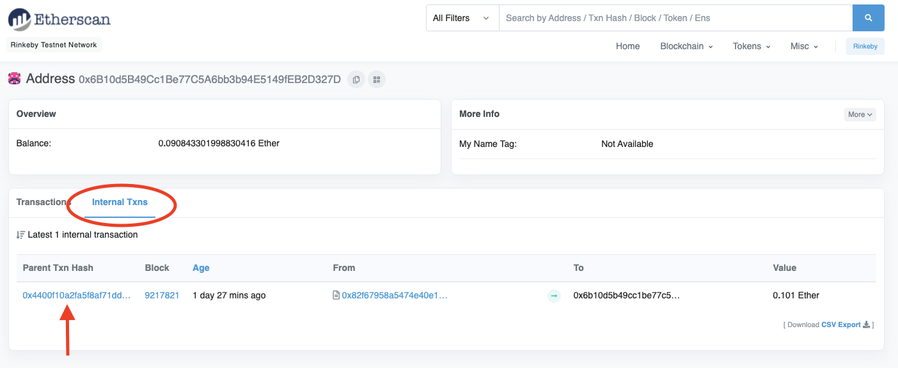

# 常问问题

## 会发行代币吗？

会的。

## 代币什么时候发行？

团队的重点是致力于以太坊的可扩展性。你可以在
[Discord](https://discord.com/invite/px2aR7w)，
[电报](https://t.me/zksync)，[推特](https://twitter.com/zksync) 上找到来自
zkSync 的任何公告。

## 为什么手续费这么高？

我们的手续费取决于以太坊第1层（L1）的 Gas 价格，因为对于每一次 zkSync 第2层 (L2)
交易，我们都会在第1层发布相关数据，这使我们能够继承以太坊的安全性。

## 取款时间是多久？

在 zkSync 使用高峰期，提现时间约为10分钟。在较低使用期间，可能需要长达 7
小时。目前，提款时间取决于 zkSync 上的活跃度，当我们完成L2区块封装就讲它们提交到
L1上，就很就完成提款。所以提款时间主要取决于L2封包时间的长短，活跃度越高，封包时间就越短，提款的时间就可以缩短到10分钟左右。

## 我提取了资金，但在我的L1账户中看不到资金

如果你的提款在 [zkScan](https://zkscan.io/)，上被标记为“完成”，但资金未到达你的钱包，你应该采取以下几个步骤：

1. 确保已经过了足够的时间。取款需要 10 分钟到 7 小时，具体取决于 zkSync 网络的使用情况。

2. 在 [Etherscan](https://etherscan.io/) 上的 "Internal Txns"(内部交易)中检查您的交易。

   - 打开 Etherscan 页面然后进入你的地址页面。
   - 点看 "Internal Txns"。 
   - 你会看到来自智能合约的交易列表。 
   - 列表中应该含有你的交易(来自 zkSync 智能合约)

 

 
 

3.  如果帐户余额与 Etherscan 上的不同，请联系你的钱包客服。

4.  根据你的钱包，你可能需要导入代币才能显示。

5.  如果上述步骤都没有帮助你，请发送电子邮件至 withdraw@zksync.io 向我们描述你的问题。它 必须包含以下信息：
    
    - 你的 zkSync 钱包地址。 
    - 你正在使用的钱包（例如 Trust， metamask 等）。 
    - 你遇到的问题。

- 你提供的信息越多，我们就能越快解决你的问题！ 

## 我使用“转账”而不是“提款”将资金转移到 L1

如果你尝试将你的 zkSync 资金提取到 L1，但使用“转账”选项而不是“取款”选项，你应该尝试使用收到资金的钱包登录 zkSync。

如果您无法登录 zkSync 钱包，你可以使用“替代提现”工具。请参阅我们的[教程](./教程.md)页面上的[替代提款](./教程.md#替代提款)部分。

## 什么是账户激活费

账户激活费是你在 zkSync 注册账户的一次性费用。此费用仅适用于你的第一个 zkSync 交易。

在更深层次上，为了更适合零知识证明，zkSync 账户定义在与以太坊不同的椭圆曲线上。激活你的帐户会与你的以太坊地址关联的这条曲线上生成并发布一个新的私钥-公钥对。

注册过程直接发生在以太坊智能合约上，因此它是 L1 交易，因此激活费是支付给以太坊矿工而不是 zkSync 验证者。

ERC-1271 兼容的钱包（如 Argent）由于与 zkSync 智能合约的更高交互性而增加了这一次性费用。如果你使用基于 CREATE2 智能合约的钱包，此操作会更便宜。

## zkScan 上的 Initiated、Committed 和 Verified 交易有什么区别？

**Initiated(发起)**: zkSync 服务器已接收并处理事务。如果交易是转账，则可以立即使用。

**Committed(提交)**: 交易出现在已提交到 L1 智能合约的区块中。

**Verified(验证)**: 交易的区块已在 L1 智能合约上得到证明和验证。

← [路线图](./路线图.md) 

[教程](./教程.md) →