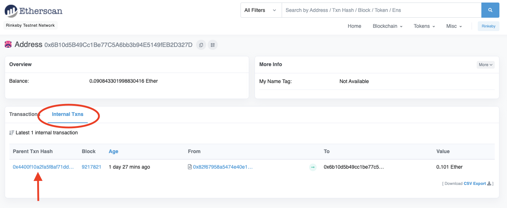

# 教程


## 使用 MetaMask 向 zkSync 添加资金

在本教程中，我们将使用 MetaMask 将资金存入 zkSync 钱包。

> 虽然本教程 MetaMask 中显示的是 Rinkeby
> 测试网图片，但你可以按照这些步骤，在主网进行操作


**第一笔存款交易会收取账户激活费。存入约 20 美元以支付高昂的 Gas 费。**
在我们的[常问问题](./常问问题.md#什么是账户激活费)解答中了解更多有关帐户激活费的信息

<br>
要将你的钱包连接到 zkSync 1.0 主网，请点击 MetaMask 顶部的"以太坊主网"按钮。

<p align="center"> 
  
</p>
  
<br>

1. 前往[https://wallet.zksync.io/](https://wallet.zksync.io/) 并连接你的钱包。

- 要连接到 zkSync 1.0 主网：
  - 单击右下角的以太坊图标。
  - 选择主网。
 
<p align="center"> 
  
</p>

<br>

<p align="center"> 
  
</p>

<br>

2. 选择"+ 充值(+ Top up)"。

<p align="center"> 
  
</p>

<br>
你可以选择不同的方法将资金存入到你的 zkSync 钱包，包括 FIAT onramps、Exchanges 或 Bridges。
对于本教程，我们将使用 zkSync 桥。
<br>

<p align="center"> 
  
</p>

<br>

3. 选择你的代币，输入金额，然后点击"充值"。

<p align="center"> 
  
</p>

<br>

- 如果你找不到你的代币：
  - 部分代币通过它们的内部ID来引用而不是他们的代币符号（例如 ERC20-23 =
    UNI），可以查看我们的[代币页面](https://zkscan.io/explorer/tokens/)
  - 将代币添加到 zkSync：
    1. 点击"找不到代币"
    2. 使用链接访问[代币页面](https://zkscan.io/explorer/tokens/)。
    3. 单击右上角的"添加新代币"并按照说明进行操作。

<br>

<p align="center">
  
</p>

<br>
如果添加需要批准的代币，那么需要在以太坊上支付 Gas 费，以授权存款到 zkSync。在继续执行步骤4之前，你将看到以下消息。 

|                                   |

<br>

4. 检查交易信息并确认。 

<p align="center"> 
  
</p>

<br>

5. 这是L1交易（当你将资金从 L1 存入 L2
   时），因此它出现在区块中的时间取决于你设置的费用。只有在 L1
   处理你的交易后，你的资金才会出现在 L2 上。如果遇到问题，请检查
   [Etherscan](https://etherscan.io/) 来监控交易。

<p align="center"> 
  
</p>

<br>

<p align="center"> 
  
</p>

<br>

6. 你的存款已完成。交易已开始，你的资金将在你的 L1
   交易经过十个区块确认后显示在你的 zkSync 钱包中。

| **已提交**                                                                                                                                          | **已验证**                                                                                                                                       |
| ------------------------------------------------------------------------------------------------------------------------------------------------------ | -------------------------------------------------------------------------------------------------------------------------------------------------- |
| 你余额旁边的一个黄色小勾表示 zkSync 服务器已处理你的交易并且你的资金已准备好并可以立即使用。 | 两个绿色小勾表示包含你交易的区块证明已经生成并提交给第 1 层的智能合约。 |
|                                                          |                                                    |

<br>
<br>

## 帐号激活

为你的账户存入或注资后的第一笔交易需要单独的账户激活操作。有关帐户激活的更多信息，请参阅[常问问题解答](./常问问题.md#什么是账户激活费)。


1. 你将被提示"授权签名帐户激活"，需要先签署信息以生成你的 zkSync L2 私钥。

<p align="center"> 
  
</p>

<br>

<p align="center"> 
  
</p>

2. 然后，系统会要求你签署消息以激活帐户（最好阅读你签署的消息）。

<p align="center"> 
  
</p>

<br>

<p align="center"> 
  
</p>

> 交易完成时，可以在交易费用下方看到账户激活费。
>
> - 要了解更多有关帐户激活费的信息，请参阅[常问问题解答](./常问问题.md#什么是账户激活费)。

<p align="center"> 
  
</p>

<br>
<br>

## 在 zkSync 上转账

在本教程中，我们将讲解如何将资金转移到另一个 zkSync 账户。无论以太坊用户是否拥有
zkSync 账户，你都可以在 zkSync 上将资金发送到他们相同的以太坊账户地址。

**请记住，这些资金将在 L2 上，因此如果你想在 L1
上使用这些资金，你可以将资金发送到[以太坊](#将资金转到以太坊)上。**

1. 点击"转账"

<p align="center"> 
  
</p>

<br>

|                                                               **如果这是你为你的 zkSync 账户存钱或注资的第一笔交易，请参阅[账户激活](#账户激活)部分。**<br>                                                               |
|:---------------------------------------------------------------------------------------------------------------------------------------------------------------------------------------------------------------------------------------------------------------------------------:|
| **如果你刷新页面或最近将你的钱包连接到 zkSync，你将被要求"授权在 zkSync 上发送"。**<br>
<br> 

<br> 

- 签署消息将重新生成你的 zkSync L2 私钥（请记住，阅读你签署的消息是一种很好的做法）。
<br>

2. 输入汇款地址，选择要转账的代币，输入金额。

- _在交易之前，你可以更改付费代币。_  
  由于 zkSync 支持"无 Gas
  元交易"，因此用户可以使用所有流行的代币来支付交易手续费。

<p align="center"> 
  
</p>

<br>

3. 签署此消息会将交易提交到 zkSync
   网络。（请记住，阅读你签署的信息是一种很好的做法）。
<p align="center"> 
  
</p>

<br>

1. 转账时间不应超过几秒钟。如果你有任何问题，请使用
   [zkScan](https://zkscan.io/) 来监控交易。

<p align="center"> 
  
</p>

<br>

1. 你的转账已完成！交易开启，资金可立即使用。

| **已提交**                                                                                                                                          | **已验证**                                                                                                                                       |
| ------------------------------------------------------------------------------------------------------------------------------------------------------ | -------------------------------------------------------------------------------------------------------------------------------------------------- |
| 你余额旁边的一个黄色小勾表示 zkSync 服务器已处理你的交易并且你的资金已准备好并立即使用。 | 两个绿色小勾表示包含你交易的区块证明已经生成并提交给第 1 层的智能合约。 |
|                                                        |                                                    |

<br>
<br>

## 将资金转到以太坊
本教程将介绍从 zkSync 提取资金回到以太坊主链的过程。 

**将资金转到交易所**: 如果你想将资金从 zkSync 转到交易所，遵循这**正确的方法**。
或者，你可以冒险在提款时输入交易所地址，但大多数交易所不查看智能合约转账，这可能需要你联系交易所的客户以查看你交易所的资金。

1. 点击"转账"

<p align="center"> 
  
</p>

<br>

2. 点击#发送到以太坊（L1）"。

<p align="center"> 
  
</p>

<br>

3. 地址栏将自动填充你的地址。
   **如果你输入不同的提款地址，请检查它是否接受智能合约转账。**

<p align="center"> 
  
</p>

<br>

|                                                               **如果这是你为你的 zkSync 账户存钱或注资的第一笔交易，请参阅[账户激活](#账户激活)部分。**<br>                                                               |
|:---------------------------------------------------------------------------------------------------------------------------------------------------------------------------------------------------------------------------------------------------------------------------------:|
| **如果你刷新页面或最近将你的钱包连接到 zkSync，你将被要求"授权在 zkSync 上发送"。**<br><br> 

<br>

- 签署消息将重新生成你的 zkSync 
  私钥（请记住，阅读您签署的消息是一种很好的做法）。

<br>

4. 选择要发送到以太坊的代币并输入金额。

- 在交易之前，你可以更改付费的代币。

由于 zkSync 支持"无 Gas 元交易"，因此用户可以使用所有流行的代币来支付交易手续费。

<p align="center"> 
  
</p>

<br>

**仔细阅读弹出窗口以防止资金损失。**  
<br>

<p align="center"> 
  
</p>

<br>

5. 确认提款金额、地址、费用，并签署信息（记住，最好阅读你签名的消息）。

<p align="center"> 
  
</p>

1. 你的提款已开始。你在 zkSync 中的账户余额将立即发生变化，但**提款时间可能需要
   10分钟到7小时才能在 L1 上可用**。

- 当网络活动增加时，区块填充得更快，提款时间减少。

| **已提交**                                                                                                                                          | **已验证**                                                                                                                                       |
| ------------------------------------------------------------------------------------------------------------------------------------------------------ | -------------------------------------------------------------------------------------------------------------------------------------------------- |
| 你余额旁边的一个黄色小勾表示 zkSync 服务器已处理你的交易并且你的资金已准备好并立即使用。 | 两个绿色小勾表示包含你交易的区块证明已经生成并提交给第 1 层的智能合约。 |
|                                                        |                                                    |

<br>
<br>

## 铸造一个 NFT

以下步骤将介绍使用 IPFS 桌面客户端铸造 NFT。

如果你不熟悉铸造 NFT ，请考虑使用社区开发的前端，如
[Open Sky](https://open-sky.vercel.app/)

> *社区开发的前端不是 zkSync
> 团队创建的，任何关于铸造的问题都需要发送给这些前端的开发者。

1. 访问[IPFS.io](https://ipfs.io/)并安装 IPFS 桌面应用。

<p align="center"> 
  
</p>

<br>

2. 点击"文件"选项，选择"+导入"，然后选择你的图片。
<p align="center"> 
  
</p>

<br>

3. 单击导入图像行末尾的三个点，然后单击"复制 CID"（内容标识符）。

<p align="center"> 
  
</p>

<br>

4. 使用以下文本创建 metadata.json
   文件或单击链接[在线创建文件](https://codebeautify.org/online-json-editor/cb3f2098)。

```json
{
  "name": "Your NFT name",
  "image": "https://ipfs.io/ipfs/CID of Image",
  "description": "Description of your NFT",
  "external_url": "Optional URL",
  "attributes": [
    {
      "trait_type": "Attribute 1",
      "value": "Value 1"
    },
    {
      "trait_type": "Attribute 2",
      "value": "Value 2"
    },
    {
      "trait_type": "Attribute 3",
      "value": "Value 3"
    }
  ]
}
```

<br>
  
5. 在"image":
   "https://ipfs.io/ipfs/末尾处输入步骤3中得到的CID，并根据需要填写其余值。

   > 示例 metadata.json 文件：

```json
{
  "name": "zkSync",
  "image": "https://ipfs.io/ipfs/QmX4kiKSy4bBB8PXqj8ZM8gNNmra3Xh1NshiaF5TRk5c2C",
  "description": "zkSync Logo",
  "external_url": "https://zksync.io/",
  "attributes": [
    {
      "trait_type": "Logo",
      "value": "Yes"
    },
    {
      "trait_type": "Color",
      "value": "Yes"
    }
  ]
}
```

<br>
  
6. 保存你的.json文件，如果你用步骤4的链接生成文件，则你需要下载下文件。

<p align="center"> 
  
</p>

<br>

7. 如步骤2所示，将 .json 文件导入 IPFS，并复制 .json 文件的 CID。 

8. 在你的 [zkSync 钱包](https://wallet.zksync.io/)上，打开 NFT
   选项卡并选择"+ 铸造 NFT "。

<p align="center"> 
  
</p>

<br>

|                                                               **如果这是你为你的 zkSync 账户存钱或注资的第一笔交易，请参阅[账户激活](#账户激活)部分。**<br>                                                               |
|:---------------------------------------------------------------------------------------------------------------------------------------------------------------------------------------------------------------------------------------------------------------------------------:|
| **如果你刷新页面或最近将你的钱包连接到 zkSync，你将被要求"授权铸造 NFT"。**<br><br> 

<br> 

- 签署消息将重新生成你的 zkSync L2
  私钥（请记住，阅读你签署的消息是一种很好的做法）。
 

<br>

9. 在"内容地址"中输入复制的 .json 文件的 CID，然后单击"Mint NFT"。


<p align="center"> 
  
</p>

<br>

10. 确认费用并签署信息（请记住，阅读您签署的信息是一种很好的做法）。

<p align="center"> 
  
</p>

<br>

11. 铸造你的 NFT 已经开始，一旦经过验证，你就可以转账或提款到 L1，这需要 10
    分钟到 7 小时。

- 当网络活动增加时，区块填充得更快，验证时间减少。

| **已提交**                                                                                                                                          | **已验证**                                                                                                                                       |
| ------------------------------------------------------------------------------------------------------------------------------------------------------ | -------------------------------------------------------------------------------------------------------------------------------------------------- |
| 你余额旁边的一个黄色复选标记表示 zkSync 服务器已处理你的交易。 | 两个绿色复选标记表示包含你交易的区块证明已经生成并提交给第1层的智能合约。 |
|                                                        |                                                    |

<br>
<br>

## 备用取款
当发送资金到无法连接 [zkSync 钱包](https://wallet.zksync.io/)的账户时，可以使用备用取款工具。 The

_如果你转账到中心化交易所时，请与他们的客户确认他们接受智能合约转账以防止资金损失。_

1. 通过在 [zkScan](https://zkscan.io/)
   上输入你的地址来检查你的帐户是否符合使用备用取款工具。

2. 检查你的帐户的以下信息：

- 1. 该帐户至少存在24小时。
- 2. 该帐户从未被激活（即 nonce 为零）。

<p align="center"> 
  
</p>

  <br>

> **如果你的账户满足使用"备用取款"工具的要求，请按照一下步骤进行操作。**

3. 进入 [备用取款页面](https://withdraw.zksync.io/).


-  _你还可以打开 [zkSync.io]((http://zksync.io/))页面， 点击 "zkTools"
   选项卡可以找到"备用取款"工具_ <br>

<p align="center"> 
  
</p>

<br>

4. 输入步骤1和2中的 zkSync 地址。

<p align="center"> 
  
</p>

<br>

5. 选择你要提取的代币和支付费用的方式。

<p align="center"> 
  
</p>

<br>

6. 在你的钱包上完成费用支付流程。

<p align="center"> 
  
</p>

<br>

7. 资金应在24小时内到账，并且可以在 [Etherscan](https://etherscan.io/) 的"Internal Txns" 下查看。
  
- 如果你在24小时内没有到账，请发送电子邮件至
  withdraw@zksync.io，并提供以下信息：
  
  - 步骤1中的你 zkSync 地址。
  - 代币和金额。
  - 费用支付的以太坊交易哈希值。
  
<p align="center"> 
  
</p>
