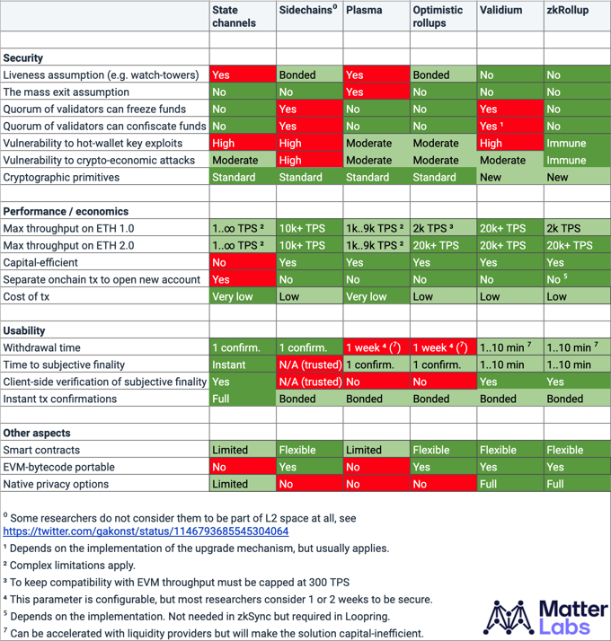

# 概览

## 介绍

**zkSync** 是一个无需信任的协议，用于以太坊上扩容的低成本支付方案，由
[zkRollup 技术](/userdocs/tech.md#zk-rollup-architecture)提供支持。它使用零知识证明和链上数据可用性来保证用户的资金安全，就好像资金从未离开过主网一样安全可靠。

虽然安全是我们的首要任务，但用户和开发人员体验是 zkSync
设计的核心。我们痴迷于寻找改进的方案以消除平台间的摩擦和降级交互的复杂性，以使
zkSync 在以太坊上成为终端用户和生态建设者最令人愉快的平台。想对 zkSync
有一个初步的印象，可以自己[尝试一下 zksync](https://wallet.zksync.io),
大概只需要2分钟。

<!-- markdownlint-disable line-length -->
<iframe width="560" height="315" src="https://www.youtube.com/embed/el-9YYGN1nw" frameborder="0" allow="accelerometer; autoplay; encrypted-media; gyroscope; picture-in-picture" allowfullscreen></iframe>
<!-- markdownlint-enable line-length -->

## zkSync 解决的问题

以太坊的 Gas 费每月[超过4000万美元](https://ethgasstation.info/)。使用 zkSync，这些成本可以降低到一小部分。

用户体验优先的加密钱包，如 [Argent](https://www.argent.xyz/)或 [Dharma](https://www.dharma.io/)
旨在为整个社会提供银行替代方案。zkSync 使这个任务可以完成。

DeFi 的兴起开启了更多有趣的用例。zkSync 在这里为你的项目解锁 Paypal 扩展问题。

## zkSync 特点

- 零依赖第三方且具有主网级安全性
- ETH 和 ERC20 代币转账即时确认，在 L1 上10分钟确人。查看[支持的代币]()。
- 超低交易费用（ERC20 代币约为主网成本的 1/100，ETH 转账约为 1/30）
- 无需注册即可接收资金
- 向现有以太坊地址（包括智能合约）付款
- 在转移的代币中方便地支付费用
- 约10分钟内提款到主网
- 支持[多重签名](https://tlu.tarilabs.com/cryptography/musig-schnorr-sig-scheme/The_MuSig_Schnorr_Signature_Scheme.html)
- [无需许可的智能合约](./智能合约.md)（即将推出）。

**目前，由于交易数量问题，填充一个区块里面的交易可能需要较长的时间。一旦区块被"密封"，它就会被发送给证明者，并在10分钟内出现在
L1 上。**

## zkSync 比较

zkSync 在现有 L2
扩容解决方案中的安全性和可用性方面[表现得非常突出](https://medium.com/matter-labs/evaluating-ethereum-l2-scaling-solutions-a-comparison-framework-b6b2f410f955)。
得益于尖端密码学和链上数据可用性的良好结合，zkRollup（zkSync
的核心技术）是唯一不需要任何操作活动来保证资金安全的 L2
扩容解决方案。例如，用户可以离线一年，然后回来并确保在没有任何外部帮助的情况下安全地提取他们的资产——即使
zkRollup 验证器早已不复存在。在我们目前的开发阶段，我们鼓励用户监控链的升级，如果他们不同意即将发生的变化则可以把资金取走。在未来，升级将需要严格的选择加入。

引用 [Vitalik Buterin 2021年的 Rollups
指南]：(https://vitalik.ca/general/2021/01/05/rollup.html):

>总的来说，我自己的观点是，在短期内 optimistic rollups 可能会在通用 EVM
>计算方面胜出，而 ZK rollups
>可能会在简单的支付、交易所和其他特定应中胜出，但在随着 ZK-SNARK
>技术的改进，中长期 ZK rollups将在所有用例中胜出 。

← [欢迎来到 zkSync](./欢迎来到zkSync.md) 

[技术](./技术.md) →

